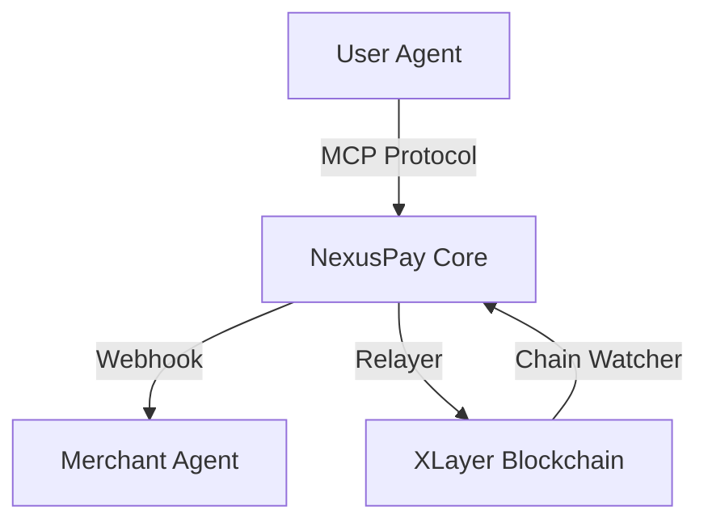

# NexusPay Core

NexusPay Core is a powerful payment orchestration layer designed to bridge the gap between AI Agents (User Agents and Merchant Agents) and blockchain-based settlement. It provides a robust, secure, and compliant framework for handling complex payment workflows in the AI economy.

## 🌟 Key Features

*   **Dual Payment Mode**: Supports both **Direct Transfer** (for instant, low-value transactions) and **Escrow Contract** (for high-value, guaranteed settlement with dispute resolution).
*   **Gasless User Experience**: Leveraging **EIP-3009** and a specialized **Relayer service**, users can sign for payments without needing to hold native gas tokens (OKB).
*   **MCP-First Architecture**: Built natively for the Model Context Protocol (MCP), allowing AI Agents to seamlessly integrate payment capabilities.
*   **12-State Robust Machine**: A comprehensive state machine manages the entire payment lifecycle, ensuring trackability and data integrity.
*   **ISO 20022 Compliance**: Data mapping and event logging follow international financial standards for seamless ERP reconciliation.
*   **Decentralized Identity (DID)**: Powered by `did:nexus` (RFC-001) for secure merchant identification and verification.

## 🏗 System Architecture

The NexusPay system operates as a hub connecting multiple agents and the blockchain:

### Core Components
- **Security Module**: EIP-712 verification, DID resolution, and anti-replay guards.
- **Order State Machine**: Manages orchestrating, tracking, and finalizing payment orders.
- **Chain Watcher**: Real-time monitoring of on-chain events for automated status updates.
- **Relayer Service**: Handles gas payment and transaction submission on behalf of the user.
- **Webhook Notifier**: Securely communicates payment results back to merchant systems.

## 🚀 Getting Started

### Prerequisites
- Node.js & npm/yarn/pnpm
- PostgreSQL (e.g., Neon)
- Access to XLayer Mainnet (Chain ID: 196)

### Tech Stack
- **Language**: TypeScript
- **Framework**: Model Context Protocol (MCP)
- **Database**: PostgreSQL (Neon)
- **Blockchain**: XLayer Mainnet (USDC settlement, Chain ID: 196)
- **Standards**: EIP-712, EIP-3009, ISO 20022

## 🔗 Deployed Contracts (XLayer Mainnet, Chain ID: 196)

| Contract | Address |
|----------|---------|
| NexusPayEscrow (Proxy) | `0x49F9ad8F2c480F8cF9e02b30f8c634F004372cc2` |
| NexusPayEscrow (Impl v4.0.0) | `0x81CF9E0d2c1ad879c24b19815Ec803015D5B2e9b` |
| USDC | `0x74b7F16337b8972027F6196A17a631aC6dE26d22` |

## 📝 Documentation

Detailed technical specifications can be found in the `docs` directory:
- [System Overview](docs/architecture/SYSTEM-OVERVIEW.md)
- [Product Requirements (PRD)](docs/prd/PRD-001-NexusPay-Core.md)
- [RFCs](docs/rfcs/): Detailed specifications for DID, Payment Core, Escrow, etc.

---

**Copyright (c) 2026 ciphertang. All rights reserved.**
